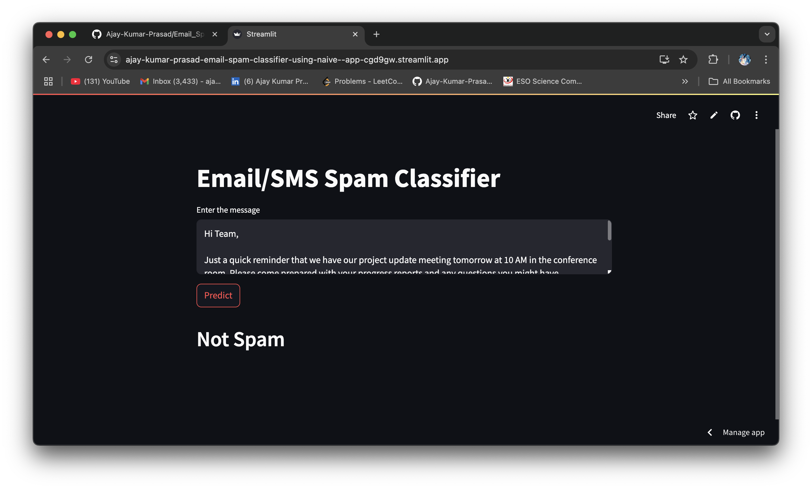
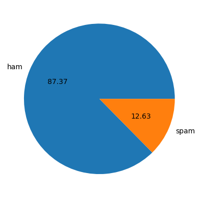
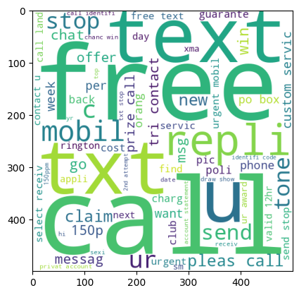
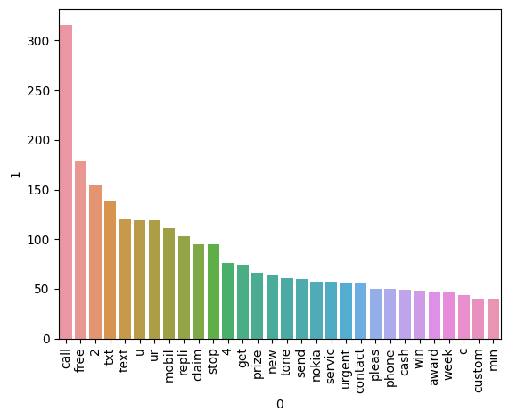
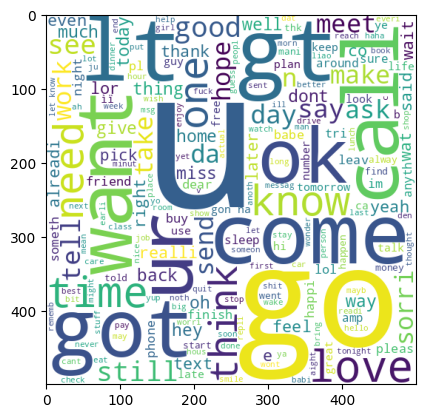
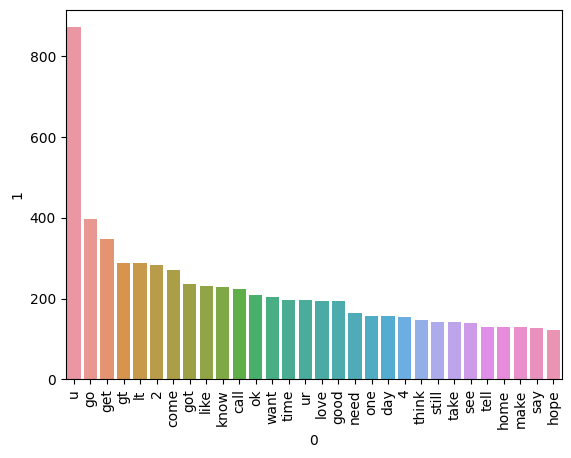

# Email_Spam_Classifier_using_Naive_Bayes
A machine learning web application built with Streamlit to classify emails or SMS messages as Spam or Not Spam using a Naive Bayes model trained on a labeled dataset.

website link:https://ajay-kumar-prasad-email-spam-classifier-using-naive--app-cgd9gw.streamlit.app/

# Model and Data

Algorithm: Multinomial Naive Bayes
Vectorization: TF-IDF
Dataset: SMS Spam Collection Dataset

# How the Model Works

This project uses a Multinomial Naive Bayes classifier to detect spam in SMS or email messages. Here's a quick overview of the workflow:

1.Preprocessing:

Convert text to lowercase
Tokenize using NLTK's TreebankWordTokenizer
Remove non-alphanumeric words and stopwords
Apply stemming with PorterStemmer

# Spam data

# Ham data

2.Feature Extraction:

Use TF-IDF Vectorizer to convert processed text into numerical vectors that represent word importance.

3.Model:

A trained Multinomial Naive Bayes model classifies the message as Spam or Not Spam based on word probabilities.

4.Prediction:

Input message → Preprocessing → Vectorization → Model Prediction → Output on Streamlit UI

# Results

Model Accuracy:     Achieved ~97% accuracy
# Project Structure
.
├── app.py                  # Streamlit app
├── model.pkl               # Trained Naive Bayes model
├── vectorizer.pkl          # Fitted TF-IDF vectorizer
├── README.md               # Project overview
└── requirements.txt        # Python dependencies
